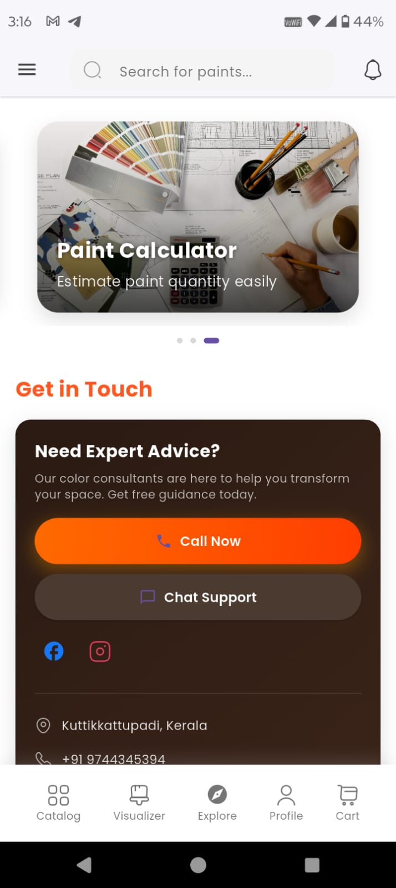

# Paint Store (Flutter + Firebase)

[](https://github.com/akashkrishna2026-coder/Paint-Store/actions/workflows/flutter-ci.yml)


Production-grade Flutter app for a paint retail experience: browse catalog, view details by pack size, manage cart and checkout, monitor stock, and run manager workflows. Recently migrated to a scalable MVVM architecture using Riverpod.

Highlights
- Flutter (stable)
- Firebase Auth + Realtime Database
- Riverpod (MVVM)
- Modern UI: Google Fonts, Iconsax, Shimmer, Cached Network Image, flutter_animate
- Integration and widget tests

## Table of Contents
- [Features](#features)
- [Screenshots](#screenshots)
- [Tech Stack](#tech-stack)
- [Architecture (MVVM with Riverpod)](#architecture-mvvm-with-riverpod)
- [Project Structure](#project-structure)
- [Getting Started](#getting-started)
- [Firebase Setup](#firebase-setup)
- [Running the App](#running-the-app)
- [Testing](#testing)
- [Linting and Formatting](#linting-and-formatting)
- [Environments and Configuration](#environments-and-configuration)
- [Quality Gates](#quality-gates)
- [Troubleshooting](#troubleshooting)
- [Roadmap](#roadmap)
- [Contributing](#contributing)
- [License](#license)

## Features
- **Cart and Checkout**
- **Product Catalog** with categories, sizes, and pricing
- **Stock Monitoring** and low-stock indicators
- **Manager Dashboard** for admin workflows
- **Notifications**
- **Painting Services**
- **Search and Filters**
- **Integration Tests** for critical flows

## Screenshots
Add PNG/JPG screenshots to `screenshots/` and they will render below. Replace placeholders with your images:

<p>
  
  
  
  
</p>

## Tech Stack
- Flutter (Dart)
- Firebase Authentication
- Firebase Realtime Database
- Riverpod (state management / MVVM)
- Android/iOS/Web targets

## Architecture: MVVM with Riverpod
This codebase was migrated to MVVM to improve testability, separation of concerns, and scaling. Views are declarative and dumb; ViewModels own state and orchestration; repositories/services isolate IO and side‑effects.

- **Model**: Domain/data models (`lib/model/`)
- **View**: Flutter UI screens (`lib/pages/`, `lib/widgets/`)
- **ViewModel**: Business/UI logic, state exposure via providers (`lib/viewmodels/`, `lib/providers/`)
- **Repository / Services**: Data access and integrations (`lib/services/`)

Why Riverpod?
- Test-friendly and compile-time safety
- No `BuildContext` dependency for reading providers
- Clear layering and dependency injection

Migration Notes
- Commit: “Migrated to MVVM architecture using riverpod”
- StatefulWidget logic moved to ViewModels
- Business rules moved from Widgets into Repositories/Services
- Navigation and side effects initiated by ViewModels with safe UI bindings

Design Principles
- One responsibility per layer; no business logic in widgets
- Pure ViewModels (no platform APIs); side-effects go through repositories/services
- Providers are the only DI boundary; no global singletons

## Project Structure
```
lib/
  model/
  pages/
    core/
    product/
    manager/
  widgets/
  product/explore/
  viewmodels/
  services/
  providers/
test/
integration_test/
pubspec.yaml
```

## Getting Started
Prerequisites
- Flutter SDK (stable channel)
- Dart SDK (bundled with Flutter)
- Firebase project
- Android Studio / VS Code

Setup
```
flutter --version
flutter pub get
```
Configure Firebase (see next section), then:
```
flutter analyze
```

## Firebase Setup
The app uses Firebase Auth and Realtime Database.

1) Create a Firebase project
- Add Android, iOS (optional), and Web (optional) apps to the project

2) Configure platforms
- Android: `android/app/google-services.json` + update `applicationId`
- iOS: `ios/Runner/GoogleService-Info.plist` and enable Firebase in AppDelegate
- Web: `web/index.html` with Firebase config snippet

3) Enable services
- Authentication: Email/Password (or others)
- Realtime Database: create necessary paths
  - `users/{uid}/cart`
  - `products/{productId}`

4) Security Rules
- Set appropriate rules for dev, then harden for prod. This repo includes a starter rules file at `database.rules.json`. Apply it from the Firebase Console or via the CLI:
  - Firebase Console: Realtime Database → Rules → Import → select `database.rules.json`
  - CLI (requires firebase-tools): `firebase deploy --only database`

Example rules (see `database.rules.json` for the latest):

```
{
  "rules": {
    ".read": false,
    ".write": false,
    "users": {
      "$uid": {
        ".read": "$uid === auth.uid",
        ".write": "$uid === auth.uid",
        "cart": {
          "$productId": {
            ".validate": "newData.hasChildren(['name','quantity'])"
          }
        }
      }
    },
    "products": {
      ".read": true,
      ".write": "auth != null && root.child('admins').child(auth.uid).exists()"
    }
  }
}
```

Note: tighten these further for production according to your data model.

## Running the App
```
flutter pub get
flutter run
```
Target a specific platform:
- Android: `flutter run -d android`
- iOS: `flutter run -d ios`
- Web: `flutter run -d chrome`

Builds:
- Android: `flutter build apk --release`
- iOS: `flutter build ipa`
- Web: `flutter build web`

## Testing
Analyze and format:
```
flutter analyze
dart format .
```
Unit/Widget tests:
```
flutter test
```
Integration tests:
```
flutter test integration_test
```

## Linting and Formatting
- `dart format .`
- `flutter analyze`
- Consider enabling additional lint rules in `analysis_options.yaml`

## Environments and Configuration
- Use `.env` or flavors if desired for dev/staging/prod
- Ensure Firebase configs per environment
- Guard any API keys or secrets (do not commit)

## Quality Gates
- CI status badge at top (GitHub Actions)
- PRs must pass `flutter analyze` (no warnings) and `flutter test`
- Optional: enable branch protection on `main` and require CI passing

## Troubleshooting
- After merges:
  - `flutter clean && flutter pub get`
- Pubspec.lock conflicts:
  - Keep `pubspec.yaml` authoritative, then `flutter pub get` to regenerate lock
- iOS pods:
  - `cd ios && pod install && cd ..`

## CI/CD
This repository can use GitHub Actions to validate pull requests and pushes to `main`.

Included workflow: `.github/workflows/flutter-ci.yml`
- Sets up Flutter (stable)
- Caches Pub dependencies
- Runs `flutter pub get`, `flutter analyze`, and `flutter test`

Extend it to build and upload artifacts if needed.

Badge
- [Flutter CI](https://github.com/akashkrishna2026-coder/Paint-Store/actions/workflows/flutter-ci.yml/badge.svg)

## Roadmap
- Offline caching and resilience
- Improved search and product tagging
- Admin tools for inventory and orders
- Enhanced notifications and analytics
- UX polish: animations, deep links

## Contributing
- Fork and branch per feature
- Run analyze/tests before PR
- Follow MVVM guidelines and keep logic in ViewModels/Repositories

## License
Add your license here (e.g., MIT).

Notes for this repository
- The project recently migrated to MVVM using Riverpod (see commit messages).
- Key UI pages include cart, home, product explore pages, and manager views.
- Firebase integration is required for login and data.

## For Hiring Managers
- MVVM migration demonstrates refactoring of a production app to a scalable, testable architecture
- Strong Firebase integration experience (Auth, Realtime DB, rules)
- CI-driven quality with analyze/tests on PRs
- UI/UX polish: animation, caching, modern component libraries
- Comfortable with conflict resolution, repo hygiene, and documentation
